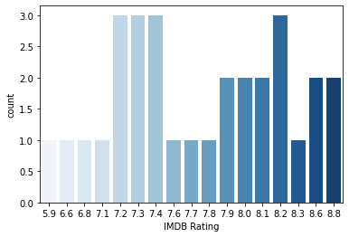

# KNN-Classifier

**KNN works by finding the distances between a query and all the examples in the data, selecting the specified number examples (K) closest to the query, then votes for the most frequent label (in the case of classification) or averages the labels (in the case of regression).**

# Introduction and Applications

1. Lazy evaluation algorithm.
2. Can be used for both classification and regression but mostly used for classification.
3. Uses Minkowski distance algorithm (Default : **Euclidian distance**).
4. Simple majority vote is used from neighbours to classify a new node.
5. **K: # of neighbours** 
   * K = small -> results in overfitting of model(Complex model)
     * Tends to capture minute details that result in training predication to be overfitted and testing prediction to fail for new data.
   * K = large -> results in underfitting of model(Simplified model)
     * Tends to capture more general trend in data results again fails in both training and testing data.
6. **Applications:** 
   * Microbology (classification of neighbouring cells mostly cancer detection)
   * Marketing (Customer segmentation)
   * Credit fraud analytics (many more examples coming soon..)
   

# Calulating distance between nodes

1. Hamiltonian distance : $D_m = \sum_{i=1}^{n}|x{_i}-y{_i}|$
2. Euclidian distance : $D_m = \left( \sum_{i=i}^{n} (x_{i}-y_{i})^{2}\right)^{1/_2}$
3. Minkowiski distance :
   * It is generaliztion of the above two as : $D_m = \left( \sum_{i=i}^{n} (x_{i}-y_{i})^{p}\right)^{1/_p}$
4. Hamming distance

# Issues with distance based algorithms

**Problem:** Distance based algo doesn't work well if features have **different Scales**.  
**Solution:** scaled all features to same i.e. normalization of feature data before hand. 

* It’s easy to implement and understand, but has a major drawback of becoming significantly slows as the size of that data in use grows.

# [Implementing KNN-Classifier ( FROM Scratch)](https://towardsdatascience.com/machine-learning-basics-with-the-k-nearest-neighbors-algorithm-6a6e71d01761)


```python
import pandas as pd
import numpy as np
import matplotlib.pyplot as plt
import seaborn as sns
```


```python
df_movies = pd.read_csv('movies_recommendation_data.csv')
df_movies.head(10)
```


<div>
<style scoped>
    .dataframe tbody tr th:only-of-type {
        vertical-align: middle;
    }

    .dataframe tbody tr th {
        vertical-align: top;
    }

    .dataframe thead th {
        text-align: right;
    }
</style>
<table border="1" class="dataframe">
  <thead>
    <tr style="text-align: right;">
      <th></th>
      <th>Movie ID</th>
      <th>Movie Name</th>
      <th>IMDB Rating</th>
      <th>Biography</th>
      <th>Drama</th>
      <th>Thriller</th>
      <th>Comedy</th>
      <th>Crime</th>
      <th>Mystery</th>
      <th>History</th>
      <th>Label</th>
    </tr>
  </thead>
  <tbody>
    <tr>
      <th>0</th>
      <td>58</td>
      <td>The Imitation Game</td>
      <td>8.0</td>
      <td>1</td>
      <td>1</td>
      <td>1</td>
      <td>0</td>
      <td>0</td>
      <td>0</td>
      <td>0</td>
      <td>0</td>
    </tr>
    <tr>
      <th>1</th>
      <td>8</td>
      <td>Ex Machina</td>
      <td>7.7</td>
      <td>0</td>
      <td>1</td>
      <td>0</td>
      <td>0</td>
      <td>0</td>
      <td>1</td>
      <td>0</td>
      <td>0</td>
    </tr>
    <tr>
      <th>2</th>
      <td>46</td>
      <td>A Beautiful Mind</td>
      <td>8.2</td>
      <td>1</td>
      <td>1</td>
      <td>0</td>
      <td>0</td>
      <td>0</td>
      <td>0</td>
      <td>0</td>
      <td>0</td>
    </tr>
    <tr>
      <th>3</th>
      <td>62</td>
      <td>Good Will Hunting</td>
      <td>8.3</td>
      <td>0</td>
      <td>1</td>
      <td>0</td>
      <td>0</td>
      <td>0</td>
      <td>0</td>
      <td>0</td>
      <td>0</td>
    </tr>
    <tr>
      <th>4</th>
      <td>97</td>
      <td>Forrest Gump</td>
      <td>8.8</td>
      <td>0</td>
      <td>1</td>
      <td>0</td>
      <td>0</td>
      <td>0</td>
      <td>0</td>
      <td>0</td>
      <td>0</td>
    </tr>
    <tr>
      <th>5</th>
      <td>98</td>
      <td>21</td>
      <td>6.8</td>
      <td>0</td>
      <td>1</td>
      <td>0</td>
      <td>0</td>
      <td>1</td>
      <td>0</td>
      <td>1</td>
      <td>0</td>
    </tr>
    <tr>
      <th>6</th>
      <td>31</td>
      <td>Gifted</td>
      <td>7.6</td>
      <td>0</td>
      <td>1</td>
      <td>0</td>
      <td>0</td>
      <td>0</td>
      <td>0</td>
      <td>0</td>
      <td>0</td>
    </tr>
    <tr>
      <th>7</th>
      <td>3</td>
      <td>Travelling Salesman</td>
      <td>5.9</td>
      <td>0</td>
      <td>1</td>
      <td>0</td>
      <td>0</td>
      <td>0</td>
      <td>1</td>
      <td>0</td>
      <td>0</td>
    </tr>
    <tr>
      <th>8</th>
      <td>51</td>
      <td>Avatar</td>
      <td>7.9</td>
      <td>0</td>
      <td>0</td>
      <td>0</td>
      <td>0</td>
      <td>0</td>
      <td>0</td>
      <td>0</td>
      <td>0</td>
    </tr>
    <tr>
      <th>9</th>
      <td>47</td>
      <td>The Karate Kid</td>
      <td>7.2</td>
      <td>0</td>
      <td>1</td>
      <td>0</td>
      <td>0</td>
      <td>0</td>
      <td>0</td>
      <td>0</td>
      <td>0</td>
    </tr>
  </tbody>
</table>
</div>


```python
df_movies.describe()
```


<div>
<style scoped>
    .dataframe tbody tr th:only-of-type {
        vertical-align: middle;
    }

    .dataframe tbody tr th {
        vertical-align: top;
    }

    .dataframe thead th {
        text-align: right;
    }
</style>
<table border="1" class="dataframe">
  <thead>
    <tr style="text-align: right;">
      <th></th>
      <th>Movie ID</th>
      <th>IMDB Rating</th>
      <th>Biography</th>
      <th>Drama</th>
      <th>Thriller</th>
      <th>Comedy</th>
      <th>Crime</th>
      <th>Mystery</th>
      <th>History</th>
      <th>Label</th>
    </tr>
  </thead>
  <tbody>
    <tr>
      <th>count</th>
      <td>30.000000</td>
      <td>30.000000</td>
      <td>30.000000</td>
      <td>30.000000</td>
      <td>30.000000</td>
      <td>30.000000</td>
      <td>30.000000</td>
      <td>30.000000</td>
      <td>30.000000</td>
      <td>30.0</td>
    </tr>
    <tr>
      <th>mean</th>
      <td>48.133333</td>
      <td>7.696667</td>
      <td>0.233333</td>
      <td>0.600000</td>
      <td>0.100000</td>
      <td>0.100000</td>
      <td>0.133333</td>
      <td>0.100000</td>
      <td>0.100000</td>
      <td>0.0</td>
    </tr>
    <tr>
      <th>std</th>
      <td>29.288969</td>
      <td>0.666169</td>
      <td>0.430183</td>
      <td>0.498273</td>
      <td>0.305129</td>
      <td>0.305129</td>
      <td>0.345746</td>
      <td>0.305129</td>
      <td>0.305129</td>
      <td>0.0</td>
    </tr>
    <tr>
      <th>min</th>
      <td>1.000000</td>
      <td>5.900000</td>
      <td>0.000000</td>
      <td>0.000000</td>
      <td>0.000000</td>
      <td>0.000000</td>
      <td>0.000000</td>
      <td>0.000000</td>
      <td>0.000000</td>
      <td>0.0</td>
    </tr>
    <tr>
      <th>25%</th>
      <td>27.750000</td>
      <td>7.300000</td>
      <td>0.000000</td>
      <td>0.000000</td>
      <td>0.000000</td>
      <td>0.000000</td>
      <td>0.000000</td>
      <td>0.000000</td>
      <td>0.000000</td>
      <td>0.0</td>
    </tr>
    <tr>
      <th>50%</th>
      <td>48.500000</td>
      <td>7.750000</td>
      <td>0.000000</td>
      <td>1.000000</td>
      <td>0.000000</td>
      <td>0.000000</td>
      <td>0.000000</td>
      <td>0.000000</td>
      <td>0.000000</td>
      <td>0.0</td>
    </tr>
    <tr>
      <th>75%</th>
      <td>64.250000</td>
      <td>8.175000</td>
      <td>0.000000</td>
      <td>1.000000</td>
      <td>0.000000</td>
      <td>0.000000</td>
      <td>0.000000</td>
      <td>0.000000</td>
      <td>0.000000</td>
      <td>0.0</td>
    </tr>
    <tr>
      <th>max</th>
      <td>98.000000</td>
      <td>8.800000</td>
      <td>1.000000</td>
      <td>1.000000</td>
      <td>1.000000</td>
      <td>1.000000</td>
      <td>1.000000</td>
      <td>1.000000</td>
      <td>1.000000</td>
      <td>0.0</td>
    </tr>
  </tbody>
</table>
</div>


```python
sns.countplot(data=df_movies,x='IMDB Rating',palette="Blues")
```


    <matplotlib.axes._subplots.AxesSubplot at 0xcb56550>





```python
from collections import Counter
import math

def knn(data, query, k, distance_fn, choice_fn):
    neighbor_distances_and_indices = []
    
    # 3. For each example in the data
    for index, example in enumerate(data):
        # 3.1 Calculate the distance between the query example and the current
        # example from the data.
        distance = distance_fn(example[:-1], query)
        
        # 3.2 Add the distance and the index of the example to an ordered collection
        neighbor_distances_and_indices.append((distance, index))
    
    # 4. Sort the ordered collection of distances and indices from
    # smallest to largest (in ascending order) by the distances
    sorted_neighbor_distances_and_indices = sorted(neighbor_distances_and_indices)
    
    # 5. Pick the first K entries from the sorted collection
    k_nearest_distances_and_indices = sorted_neighbor_distances_and_indices[:k]
    
    # 6. Get the labels of the selected K entries
    k_nearest_labels = [data[i][1] for distance, i in k_nearest_distances_and_indices]

    # 7. If regression (choice_fn = mean), return the average of the K labels
    # 8. If classification (choice_fn = mode), return the mode of the K labels
    return k_nearest_distances_and_indices , choice_fn(k_nearest_labels)

def mean(labels):
    return sum(labels) / len(labels)

def mode(labels):
    return Counter(labels).most_common(1)[0][0]

def euclidean_distance(point1, point2):
    sum_squared_distance = 0
    for i in range(len(point1)):
        sum_squared_distance += math.pow(point1[i] - point2[i], 2)
    return math.sqrt(sum_squared_distance)
```

# Using SKlearn : KNN-Regressor


```python
from sklearn.neighbors import KNeighborsRegressor
from sklearn.metrics import mean_absolute_error
from sklearn.model_selection import train_test_split
from sklearn.preprocessing import MinMaxScaler
```


```python
columns_to_keep = ['Biography', 'Drama',
       'Thriller', 'Comedy', 'Crime', 'Mystery', 'History']
X = df_movies[columns_to_keep]
y = df_movies['IMDB Rating']

X_train,X_test,y_train,y_test = train_test_split(X,y,random_state=0)

scaler = MinMaxScaler()
X_train_scaled = scaler.fit_transform(X_train)
X_test_scaled = scaler.transform(X_test)

knn_movie_rater = KNeighborsRegressor(n_neighbors=5)

knn_movie_rater.fit(X_train_scaled,y_train)

print('Accuracy of K-NN classifier on training set: {:.2f}'
     .format(knn_movie_rater.score(X_train_scaled, y_train)))
print('Accuracy of K-NN classifier on test set: {:.2f}'
     .format(knn_movie_rater.score(X_test_scaled, y_test)))

the_post = [[1, 1, 0, 0, 0, 0, 1]]
the_post_scaled = scaler.transform(the_post)
# actual rating is 7.2

print('The IMDB Rating fot the post movie is: {:.2f}'.format(knn_movie_rater.predict(the_post_scaled)[0]))
```

    Accuracy of K-NN classifier on training set: 0.12
    Accuracy of K-NN classifier on test set: -0.05
    The IMDB Rating fot the post movie is: 7.68
    
